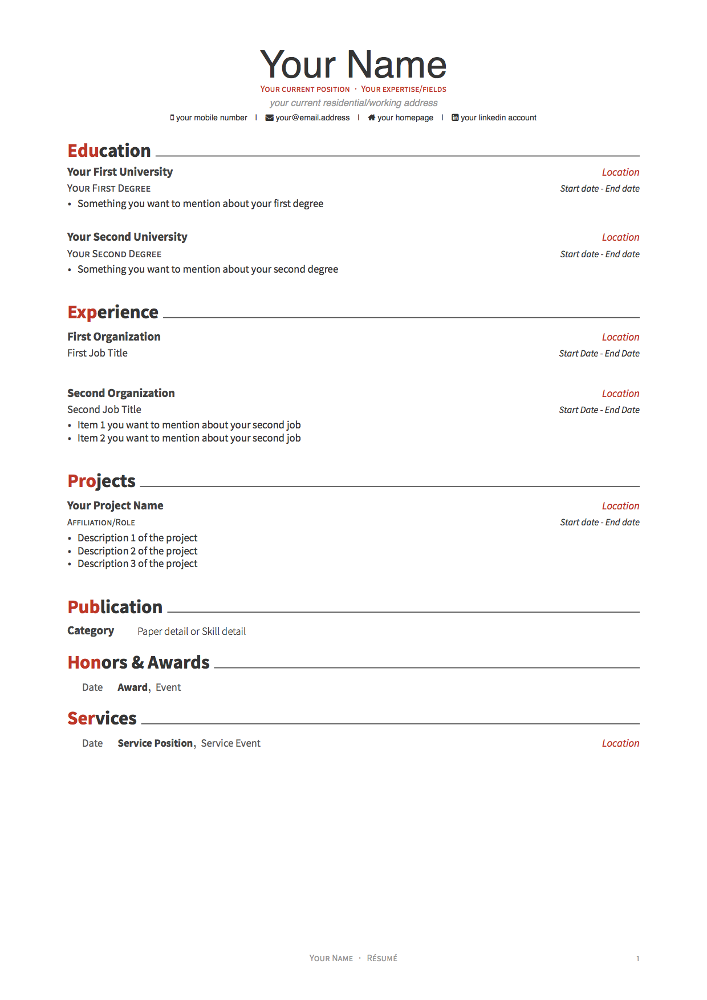
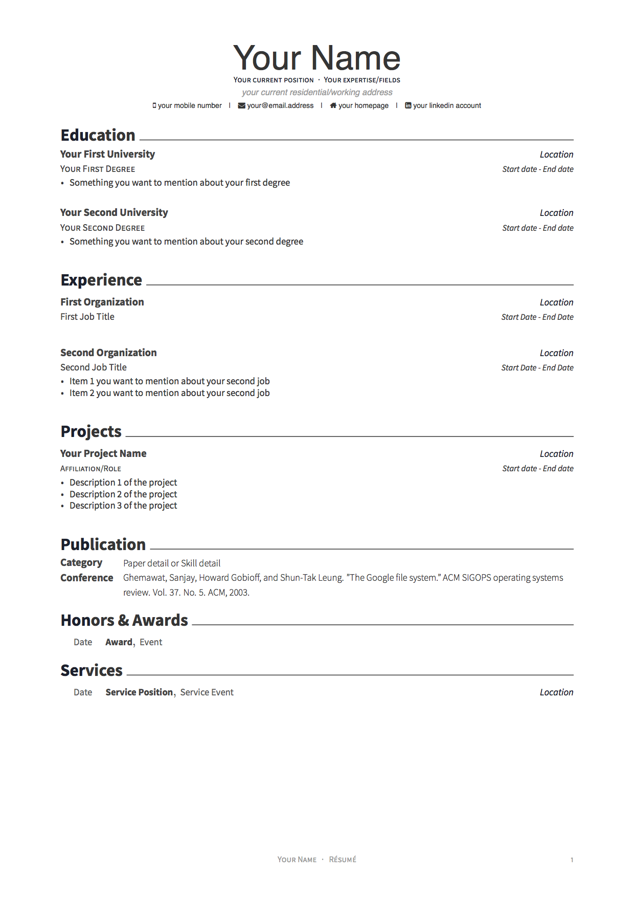
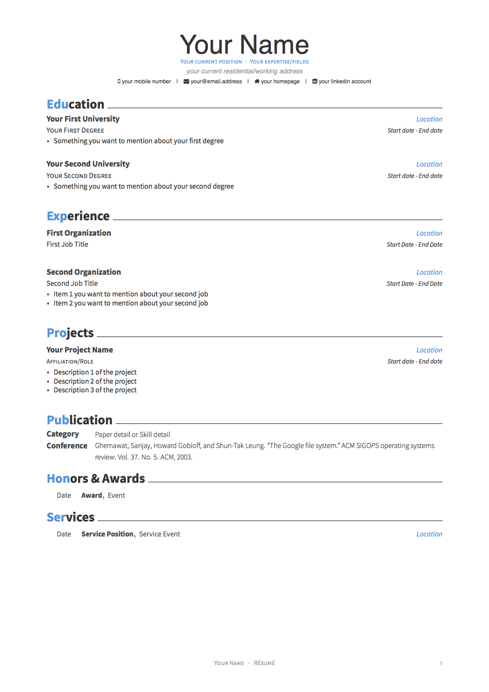

# Professional Resume

I designed a neat and comprehensive resume template inspired by *Awesome Resume/CV and Cover Letter* (it was originally created by Claud D. Park (GitHub repository) but has been modified for LaTeX Templates website by Vel.)

Orignally, it is used for people who are apply for academic positions, like PhD/Master student, research assistant/associate, postdoc fellow, and even professor. However, I believe that this resume template is also suitable to other professional people. 

There are different colors for you: red, emerald, skyblue, pink, orange, nephritis, concrete, darknight. You can also define your own color through color code.

Overall, it is easy to use and modify.

   
